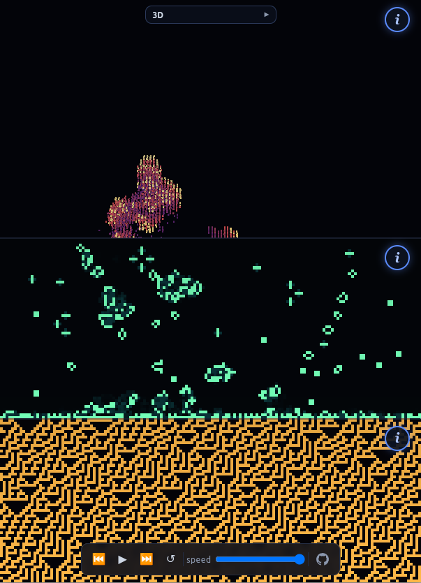

# Automata: Rule 30 → Game of Life → 3D CA

Three stacked cellular automata feeding into each other:

1D feeds into 2D feeds into 3D.

Rendered through WebGPU, written in Rust, compiled to WASM.



## AI assistance

Years ago I coded the Rule 30 to Game of Life (1D to 2D) using javascript
and WebGL, but failed to get a 3D CA working. In 2026 I revisited this with
ClaudeClaude and vibecoded the 3D CA along with:

- porting from WebGL to WebGPU
- refactored from Javascript to Rust + WASM

## Build & run

Rust with `wasm32-unknown-unknown` target and `wasm-bindgen-cli` are required. Then:

```sh
rustup target add wasm32-unknown-unknown
cargo install wasm-bindgen-cli --version 0.2.123 --locked

./build.sh --serve        # --serve to srv on 8080
```

Needs a WebGPU-capable browser (recent Chrome/Edge/Firefox/Safari).

## Info popups ⓘ

It's all plain markdown in `web/content/`, edit and reload (no rebuild needed).

## Tests

`cargo test --release` runs host-side simulation tests. `cargo test --release --test explore_rules --ignored --nocapture` runs the rule-exploration harness used to choose the presets

...it's not great, and I'm not sure any of the rulesets are good for this use-case. For example crystal growth and pyroclastic consumes the world from any input. It was interesting to poke at nevertheless
