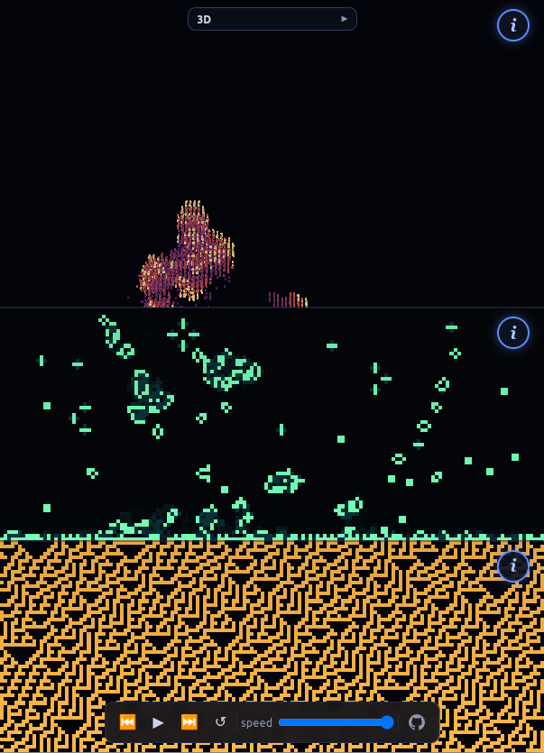

# Automata: Rule 30 → Game of Life → 3D CA

Three stacked cellular automata feeding into each other:

1D feeds into 2D feeds into 3D.

Rendered through WebGPU, written in Rust, compiled to WASM.



## AI assistance

Years ago I coded the Rule 30 to Game of Life (1D to 2D) using javascript
and WebGL, but failed to get a 3D CA working. In 2026 I revisited this with
ClaudeClaude and vibecoded the 3D CA along with:

- porting from WebGL to WebGPU
- refactored from Javascript to Rust + WASM

## Build & run

Rust with `wasm32-unknown-unknown` target and `wasm-bindgen-cli` are required. Then:

```sh
rustup target add wasm32-unknown-unknown
cargo install wasm-bindgen-cli --version 0.2.123 --locked

./build.sh --serve        # --serve to srv on 8080
```

Needs a WebGPU-capable browser (recent Chrome/Edge/Firefox/Safari).

## Info popups ⓘ

It's all plain markdown in `web/content/`, edit and reload (no rebuild needed).

## Tests

`cargo test --release` runs host-side simulation tests. `cargo test --release --test explore_rules --ignored --nocapture` runs the original rule-exploration harness.

`cargo test --release --test rule_search search -- --ignored --nocapture` runs the search the current presets came from. It records what the cascade really feeds the 3D floor, then scores each rule and drift speed on how busy it stays without filling the box (`N=` sets how many random rules to try alongside the known ones, `PHONE=1` uses a phone-width feed). `cargo test --release --test feed_stats -- --ignored --nocapture` shows what reaches the floor over time.
`feed_vs_height` shows how the Game of Life band's height changes that, and `bench3d` times a 3D step (both `--ignored --nocapture`). For the search, `DIMS=nx,ny,nz` sets the 3D box size and `GOL_ROWS=` the Life band height.

...it's not great, and I'm not sure any of the rulesets are good for this use-case. For example crystal growth and pyroclastic consumes the world from any input. It was interesting to poke at nevertheless
